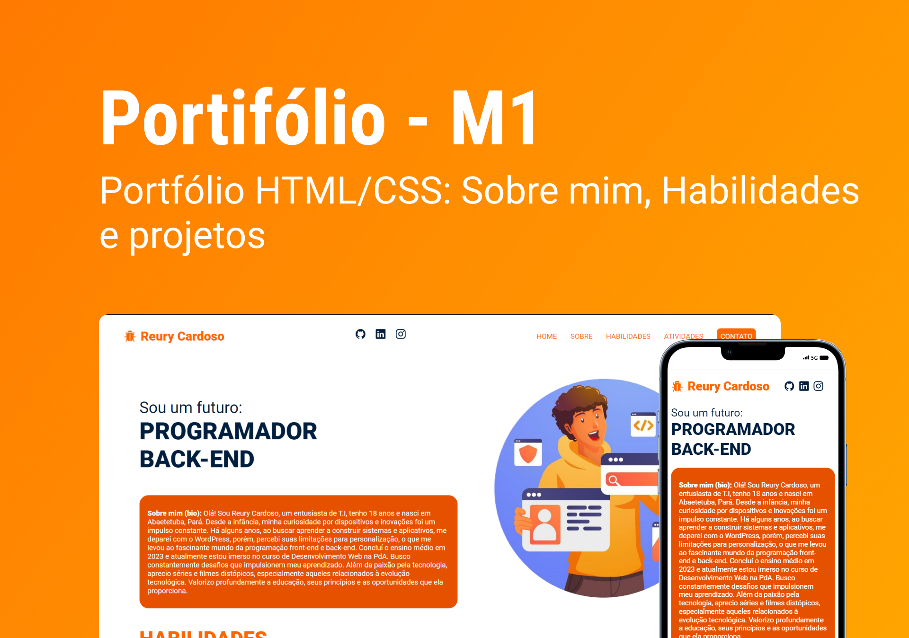

<h1 align="center"> Portfólio - Reury Cardoso </h1>

Projeto desenvolvido no módulo 01, do curso Programadores do Amanhã.  

  <a href="#tecnologias">Tecnologias</a>&nbsp;&nbsp;&nbsp;|&nbsp;&nbsp;&nbsp;
  <a href="#informações">Informações</a>&nbsp;&nbsp;&nbsp;|&nbsp;&nbsp;&nbsp;
  <a href="#projeto">Projeto</a>&nbsp;&nbsp;&nbsp;|&nbsp;&nbsp;&nbsp;
  <a href="#memo-licença">Licença</a>

  

 

  

<h2 id="tecnologias"></h2>

## 🚀 Tecnologias 

Esse projeto foi desenvolvido com as seguintes tecnologias:

- HTML e CSS
- Git e Github
- Figma

<h2 id="informações"></h2>

## 📌 Informações

- Sobre mim
- Habilidades
- Atividades e projetos

<h2 id="projeto"></h2>

## 💻 Projeto

Portfólio desenvolvido na atividade de mini-projeto proposto pela organização Programadores do Amanhã, utilizando HTML e CSS.

- [Visite o projeto online](https://reury-cardoso.github.io/portfolio-projetoM1/)

## Autor

[Reury](https://github.com/reury-cardoso)

## :memo: Licença

Este projeto é licenciado sob a Licença [MIT]